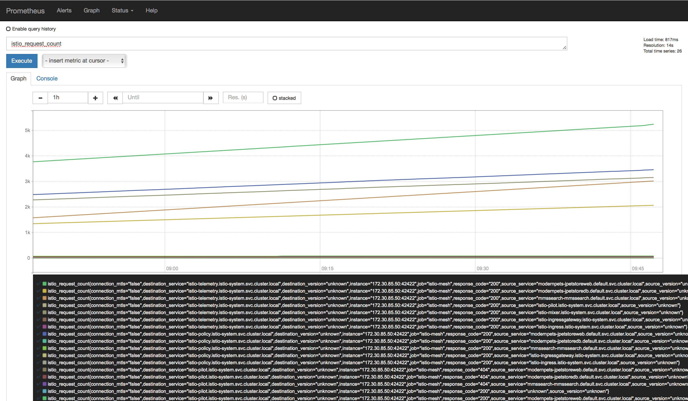
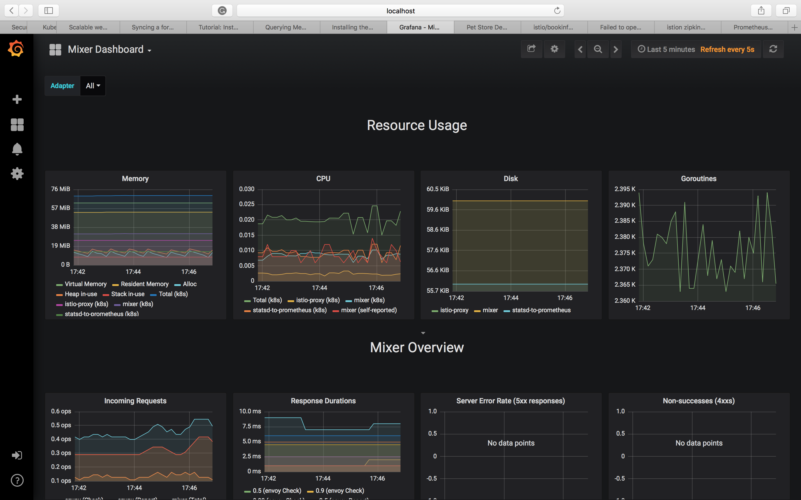
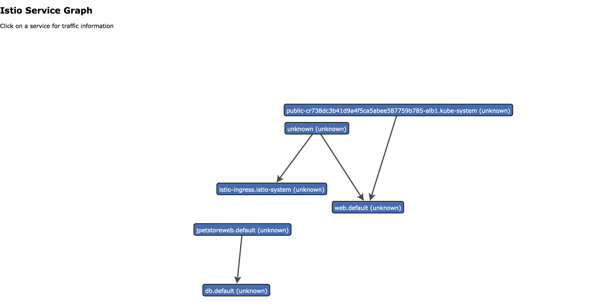
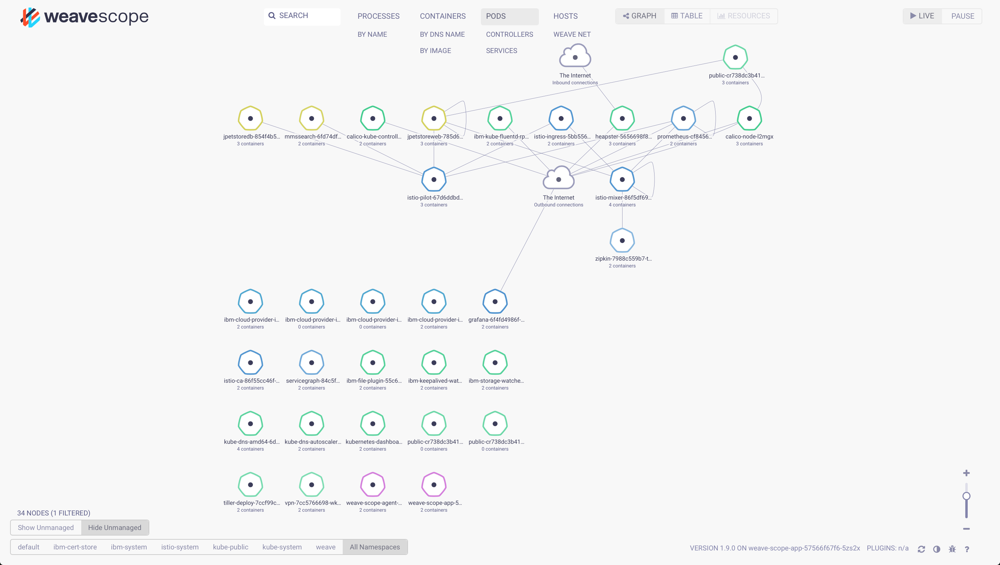
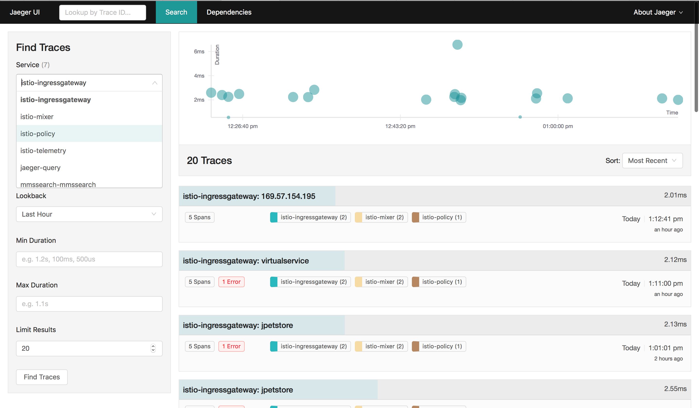

# Obtain and visualise uniform metrics, logs, traces across different services using Istio.

*Work in Progress*

You will be using add-ons like Jaeger, Prometheus, Grafana, Servicegraph & Weavescope to collect, query and visualize metrics, logs & traces.

## Pre-req

1. **Your cluster needs at least 4 CPUs to install Istio and the JPetStore application.** If you are using an existing cluster with less than 4 CPUs, add worker nodes to increase the cluster capacity.
1. Follow the instructions in the parent [README](../README.md) to deploy the secrets and applications using helm.
1. *Uninstall* the JPetStore applications with helm (you will reinstall them later once Istio is enabled):

   ```sh
   helm delete jpetstore --purge
   helm delete mmssearch --purge
   ```

## Setup istio

[Istio](https://www.ibm.com/cloud/info/istio) is an open platform to connect, secure, and manage a network of microservices, also known as a service mesh, on cloud platforms such as Kubernetes in IBM® Cloud Kubernetes Service. With Istio, you can manage network traffic, load balance across microservices, enforce access policies, verify service identity, and more.

Install Istio in your cluster.

1. From your home directory, run this command to download the latest version by using curl:

   ```
   # from ~
   curl -L https://git.io/getLatestIstio | sh -
   ```

2. Change the directory to the Istio file location.

   ```
   cd istio-0.8.0
   ```

3. Add the `istioctl` client to your PATH. For example, run the following command on a MacOS or Linux system:

   ```
   export PATH=$PWD/bin:$PATH
   ```
   Run `istioctl version` to confirm successful setup. Next, deploy the JPetStore sample app into your cluster.


## Deploy with Helm

1. If a service account has not already been installed for Tiller, install one by pointing to the istio's`PATH`

   ```bash
   # from ~/istio-0.8.0
   kubectl create -f install/kubernetes/helm/helm-service-account.yaml
   ```

2. Install Tiller on your cluster with the service account:

   ```bash
   helm init --service-account tiller
   ```

3. Install Istio with [automatic sidecar injection](https://istio.io/docs/setup/kubernetes/sidecar-injection/#automatic-sidecar-injection) (requires Kubernetes >=1.9.0):

   ```bash
   helm install install/kubernetes/helm/istio --name istio --namespace istio-system --set tracing.enabled=true,servicegraph.enabled=true
   ```
   `tracing.enabled=true`enables to collect trace spans ; `servicegraph.enabled=true`enables and provides a web-based interface for viewing service graph of the service mesh. 

4. The Istio-Sidecar-injector will automatically inject Envoy containers into your application pods assuming running in namespaces labeled with `istio-injection=enabled`

   ```bash
   kubectl label namespace <namespace> istio-injection=enabled
   ```
   If you are not sure, use `default` as your `<namespace>`. To check the label, run this command `kubectl get namespaces -L istio-injection`

5. Install JPetStore and Visual Search using the helm yaml files

    ```sh
    # Change into the helm directory of JPetstore app
    cd ../helm
    
    # Create the JPetstore app
    helm install --name jpetstore ./modernpets
    
    # Create the MMSSearch microservice
    helm install --name mmssearch ./mmssearch 
    ```

6. By default, Istio-enabled services are unable to access URLs outside of the cluster because iptables is used in the pod to transparently redirect all outbound traffic to the sidecar proxy, which only handles intra-cluster destinations.

    Create an `ServiceEntry` to allow access to an external HTTPS service:

    ```sh
    kubectl create -f ../istio/egressgateway.yaml
    ```

    Notice that we also create a corresponding `DestinationRule` to initiate TLS for connections to the HTTPS service. Callers must access this service using HTTP on port 443 and Istio will upgrade the connection to HTTPS.

## You're Done!

You are now ready to use the UI to shop for a pet or query the store by texting a picture of what you're looking at:

1. Access the java jpetstore application web UI for JPetstore at `http://jpetstore.<Ingress Subdomain>/`

   
2. Access the mmssearch app and start uploading images from `pet-images` directory.

   


### Load Generation for demo purposes

In a demo situation you might want to generate load for your application (it will help illustrate the various features in the dashboard). This can be done through the loadtest package:

```shell
# Use npm to install loadtest
npm install -g loadtest

# Generate increasing load (make sure to replace <Ingress Subdomain> with the name of your ingress subdomain)
loadtest http://jpetstore.<Ingress Subdomain>/
```

**Note:** Rerun the loadtest before every step to see the metrics and logging in realtime.

## In-depth telemetry from the service mesh through dashboards

With the application responding to traffic, the graphs will start highlighting what's happening under the covers.

### Logs & Metrics collection and monitoring with Prometheus

Prometheus scrapes metrics from instrumented jobs, either directly or via an intermediary push gateway for short-lived jobs. It stores all scraped samples locally and runs rules over this data to either aggregate and record new time series from existing data or generate alerts. [Grafana](https://grafana.com/) or other API consumers can be used to visualize the collected data.

Under `istio` folder of JPetstore app, a YAML file is provided to hold configuration for the new metric and log stream that Istio will generate and collect automatically. On your terminal or command prompt, navigate to `istio` folder and push the new configuration by running the below command

```sh
istioctl create -f istio-monitoring.yaml
```

In Kubernetes environments, execute the following command:

```sh
kubectl -n istio-system port-forward $(kubectl -n istio-system get pod -l app=prometheus -o jsonpath='{.items[0].metadata.name}') 9090:9090 &   
```

Visit <http://localhost:9090/graph> in your web browser and look for metrics starting with `istio`. Type `istio_request_count`in the **Expression** box and click **Execute**. Click on the **Graph** tab to see the istio_request_count metrics. You can add multiple graphs by clicking on **Add Graph**.



### Visualizing Metrics with Grafana

Remember to install **Prometheus** addon before following the steps below

1. To view Istio metrics in a graphical dashboard install the Grafana add-on.

   Point to the folder where you have install istio and In Kubernetes environments, execute the following command:

   ```sh
   kubectl apply -f install/kubernetes/addons/grafana.yaml
   ```

2. Verify that the service is running in your cluster.

   In Kubernetes environments, execute the following command:

   ```sh
   kubectl -n istio-system get svc grafana
   ```

   The output will be similar to:

   ```
   NAME      CLUSTER-IP      EXTERNAL-IP   PORT(S)    AGE
   grafana   10.59.247.103   <none>        3000/TCP   2m
   ```

3. Open the Istio Dashboard via the Grafana UI.

   In Kubernetes environments, execute the following command:

   ```sh
   kubectl -n istio-system port-forward $(kubectl -n istio-system get pod -l app=grafana -o jsonpath='{.items[0].metadata.name}') 3000:3000 &
   ```

   Visit <http://localhost:3000/dashboard/db/istio-dashboard> in your web browser.

   

   


### Generating a service graph

If you have enabled servicegraph while deploying the microservices with helm, run the below command

```
kubectl -n istio-system port-forward $(kubectl -n istio-system get pod -l app=servicegraph -o jsonpath='{.items[0].metadata.name}') 8088:8088 &
```

Visit <http://localhost:8088/force/forcegraph.html> in your web browser. Try clicking on a service to see details on the service. Real time traffic data is shown in a panel below. The results will look similar to:



## Visualise Cluster using Weave Scope
While Service Graph displays a high-level overview of how systems are connected, a tool called Weave Scope provides a powerful visualisation and debugging tool for the entire cluster.

Using Scope it's possible to see what processes are running within each pod and which pods are communicating with each other. This allows users to understand how Istio and their application is behaving.

Scope is deployed onto a Kubernetes cluster with the command

```sh
kubectl apply -f "https://cloud.weave.works/k8s/scope.yaml?k8s-version=$(kubectl version | base64 | tr -d '\n')"
```

**Open Scope in Your Browser**

```sh
kubectl port-forward -n weave "$(kubectl get -n weave pod --selector=weave-scope-component=app -o jsonpath='{.items..metadata.name}')" 4040
```

The URL is: http://localhost:4040.



### [Optional] Distributed tracing with Jaeger

In `istio/ingressgateway.yaml`,Replace the `<Ingress Subdomain>` with your subdomain and run the below 

```sh
kubectl create -f istio/ingressgateway.yaml
```

Setup access to the Jaeger dashboard URL using port-forwarding:

```sh
kubectl port-forward -n istio-system $(kubectl get pod -n istio-system -l app=jaeger -o jsonpath='{.items[0].metadata.name}') 16686:16686 &
```

Then open your browser at [http://localhost:16686](http://localhost:16686/) -> Select a trace and click **Find Traces**. If you click on the top (most recent) trace, you should see the details corresponding to your latest refresh. 



## Clean up

Uninstall istio using Helm:

```
helm delete --purge istio

helm delete jpetstore --purge
helm delete mmssearch --purge
```

## Related Content

- [More information on istio.io](https://istio.io/docs/guides/telemetry.html)
